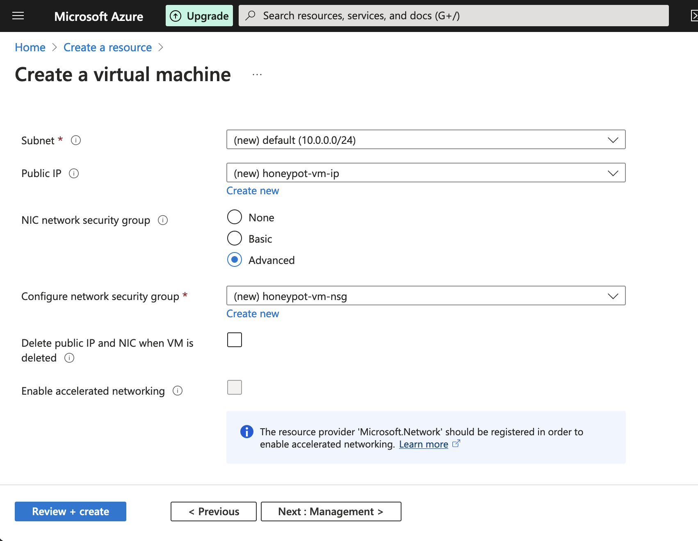

# Azure-Honeypot-Lab

## Using Microsoft Sentinel To Monitor A Honeypot & Map Live Attacks

<figure><figcaption></figcaption></figure>

***

### TL;DR

_**Technologies used**: Virtual Machines, Azure Log Analytics Workspace, Azure Sentinel (SIEM), PowerShell, Kusto Query Language (KQL), Geolocation API_

In this lab, I set up a vulnerable virtual machine and exposed it to the public internet as a honeypot. I then configured Azure’s Log Analytics Workspace to collect logs from failed remote login attempts. Lastly, I used Azure Sentinel to analyze the logs and created a heatmap that visualized the geographic locations of the attackers on a world map.

<figure><figcaption>
Project Overview
</figcaption></figure>

***

### Table Of Contents

* Step 1: Set Up the Honeypot
* Step 2: Configure Data Collection in Azure Sentinel
* Step 3: Set Up Custom Logs for Failed Login Attempts
* Step 4: Analyze and Process Logs in Azure Sentinel
* Step 5: Visualize Attacks on a Map

***

## Using Microsoft Sentinel To Monitor A Honeypot & Map Live Attacks

<figure><figcaption>
Visual Overview
</figcaption></figure>

***

### TL;DR

Technologies used
